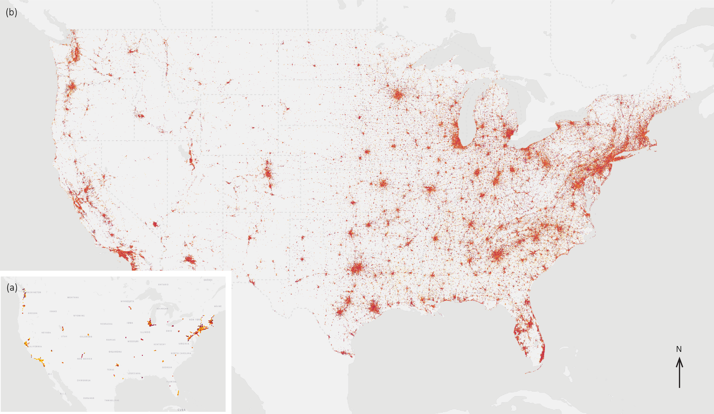
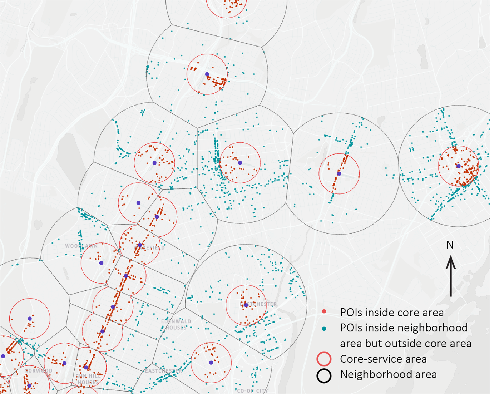

# Cluster metro station with mobility records
# Backgrounds
In this session, we will use a research project as a case to show the basic usage of clustering algorithm in urban studies.
Transit-oriented-development (TOD) is a community development model. Time-variant variables, dynamic human activities throughout different times of the day and week matter in further unpacking the characteristics of TODs. Given that this aspect has been under-discussed in most previous TOD literature, this research provides an activity-based framework to classify commuter transit station areas by considering the degree of local vibrancy - the temporal visiting pattern of all points of interest (POIs) that fall within the station areas. We apply a two-step semi-unsupervised clustering algorithm to classify 4,290 station areas from 54 metropolitan areas across the U.S. This method produces 13 distinct station area types.
Figure below show the simple presentation of all the POIs considered in this study.

Figure below show how we assign each POI to the catchment area of a TOD. These steps are beyond our exercise today.

## Goal
## File structure
## Resource

* Good Reading [Link](https://towardsdatascience.com/unsupervised-learning-and-data-clustering-eeecb78b422a)